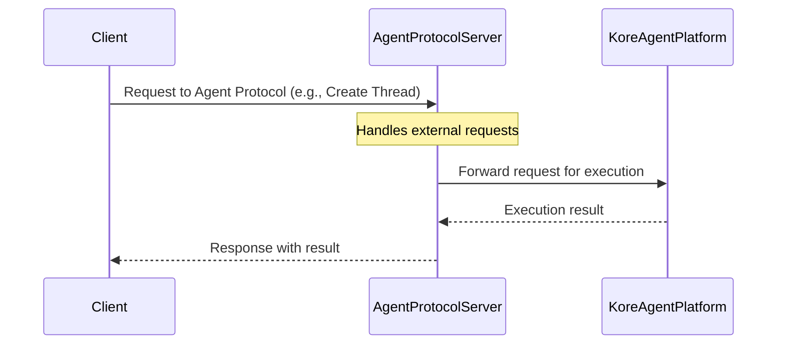
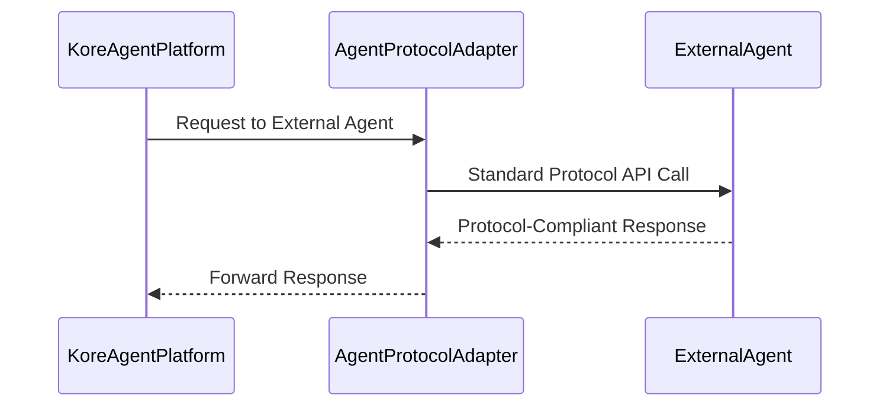
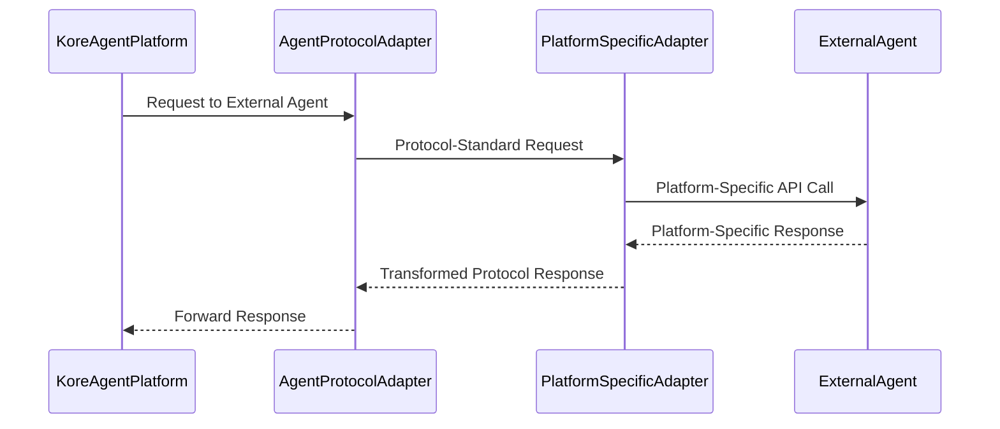
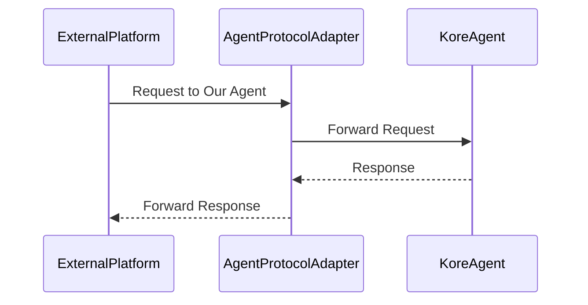

# Integrating External Agents Using Agent Protocol

## 1. Subscribing to the Agent Protocol

We are planning to start a new server that subscribes to the Agent Protocol. This server will be the world-facing entity for all interactions with the agent platform and will internally communicate with our microservices for actual execution.

### Architecture Overview 

### Example Endpoints

Base URL: `https://agentplatform.kore.ai/api/v1/apps/{appId}/environments/{envId}`

- **Create Thread**: `POST /threads`
- **Create Run**: `POST threads/{threadId}/runs`
- **Memory Store**: `POST threads/{threadId}/memory`

### Authentication Approaches

- **Approach 1: AAA Server Authentication**
  - Request first goes to AAA Server for authentication
  - Upon successful auth, redirects to Agent Protocol Server with token
  - Maintains existing AAA Server security patterns
  - Better for existing platform integrations

- **Approach 2: Agent Protocol Server Middleware**
  - Authentication middleware directly on Agent Protocol Server
  - Validates tokens/credentials before processing requests
  - More suitable for standalone deployments
  - Simpler architecture but requires duplicate auth logic

**Security Considerations:**
- All communications must be over HTTPS
- Token-based authentication for all API calls
- Rate limiting for external requests
- Audit logging for security events
- Platform-specific security requirements handled in adapters

## 2. Integrating External Agents

We support two types of external agent integrations:
1. Protocol-compliant agents (following Agent Protocol)
2. Non-protocol agents (custom platform-specific implementations)

### Integration Scenarios

#### Scenario 1: Protocol-Compliant External Agent in Our Platform

#### Scenario 2: Non-Protocol External Agent in Our Platform

#### Scenario 3: Our Agent in External Platform

### Example External Platforms

1. Protocol-Compliant Platforms:
   - LangChain Agents

2. Non-Protocol Platforms:
   - Microsoft Autogen
   - Custom Platform Adapters
   - Platform-specific implementations

### Integration Strategy

For non-protocol compliant platforms:
1. Create platform-specific adapters
2. Transform platform-specific requests/responses to Agent Protocol format
3. Maintain consistent internal communication using Agent Protocol
4. Handle platform-specific authentication and data formats
